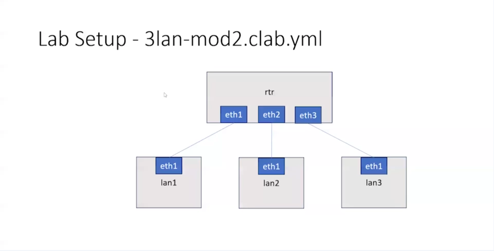

# Introduction



在这个演示中，我们将在 Linux 下通过一些命令行配置来操作路由表

我们提供了一个拓扑名为 mod2-play 的 containerlab 拓扑配置文件（3lan-mod2.clab.yml）。 其中有 3 台主机（分别名为 lan1、lan2 和 lan3）连接到 1 台路由器（名为 rtr）（路由器只是我们要配置的一台 Linux 主机）。 要启动容器，请运行以下命令。

```
sudo containerlab deploy
```

注意：完成后，如果想拆除实验室设置，请运行 `sudo containerlab destroy` 。

我们提供了 3 个示例脚本，每个脚本都说明了一件事。 每个脚本都提供一个 “create ”函数和一个 “delete”函数，让你可以运行一个脚本创建一个设置，然后删除该设置，再用另一个脚本重新创建。

```
./setup-ip-ex1.sh create
./setup-ip-ex1.sh delete
```

快捷别名指令

```
lan1="docker exec -it  clab-mod2-play-lan1"
```

 使用别名示例

```
$lan1 ip addr add 10.0.1.2 dev eth1
````

# Example 1: setup-ip-ex1.sh 

说明不使用 via 时的情况 

此脚本将为每台主机添加 IP 地址，并为 10.0.0.0/16 设置路由条目，但不使用 via。

尽管所有路由表都已设置，但从 lan1 Ping 到 lan3 应该无法正常工作，因为 lan* 路由表项假定它们是直接连接的（所以它会 ARP 目标地址）

```
lan1 ping 10.0.3.2
```
```
路由器的eth1不知道谁是10.0.3.2
root@docker:~/linux-network/02-router/demo1-cli# lan1 ping 10.0.3.2
PING 10.0.3.2 (10.0.3.2) 56(84) bytes of data.
From 10.0.1.2 icmp_seq=1 Destination Host Unreachable
From 10.0.1.2 icmp_seq=2 Destination Host Unreachable
From 10.0.1.2 icmp_seq=3 Destination Host Unreachable
```
# Example 2: setup-ip-ex2.sh 

说明使用 via 时会发生什么。

从 lan1 Ping 到 lan3 可以正常工作，因为 lan* 路由表项现在表示要通过路由器

```
lan1 ping 10.0.3.2
```

# Example 3: setup-ip-ex3.sh

这将显示分配了多个 IP 地址的接口。


默认情况下，它会使用最先定义的 IP 地址（10.0.1.2）作为源地址。

```
lan1 ping 10.0.3.3
```

This will use a specific source IP address

```
lan1 ping -I 10.0.1.3 10.0.3.3
```


# Example 4: setup-ip-ex4.sh 

说明如何设置 GRE 隧道。 

它创建了一个本地/远程指向 10.0.1.2/10.0.3.2 的 GRE 隧道（这是外层报头）

然后给设备一个不同前缀的地址 192.168.0.1/192.168.0.2（这是内标头）


设置完成后，就可以 ping 192.168 前缀了：

```
lan1 ping 192.168.0.2
```

You can run tshark

```
# won't have encapsulation
lan1 tshark -O gre -i gre1

# will  have encapsulation
lan1 tshark -O gre -i eth1 

# See encapsulation as it traverses the router
rtr tshark -O gre -i eth1  
```

# Neighbor

Ex1 和 Ex2 与发送的 ARP 请求具体相关。 因此，在 ping 之前，用 `ip neigh` 查看 ARP 表也是合理的。

查看 ARP 表 - lan1 上的表应该是空的

````
lan1 ip neigh
````

进行 ping（查看第一个数据包是否为 ARP - 使用 tshark 查看）

```
lan1 ip neigh
```

它应该输出   10.0.1.1 dev eth1 lladdr aa:c1:ab:4e:9b:e5 REACHABLE

过一会儿

```
lan1 ip neigh
```

应输出（显示条目已过时）：    10.0.1.1 dev eth1 lladdr aa:c1:ab:4e:9b:e5 STALE

您可以明确刷新：（您将再次看到 ARP）

```
lan1 ip neigh flush all
```

